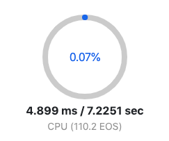

# CPU

## 개요

이오스에서 트랜잭션을 처리할 때 소모되는 **시간**을 정량적으로 표현한 자원이다.

[CPU](cpu.md)는 트랜잭션을 실행하기 위하여 필요한 기본요소 3가지\( [CPU](cpu.md) , [NET](../n/net.md) , [RAM](../r/ram.md) \) 중 하나이다. 실제 이오스 메인넷을 이용하고 있는 사용자라면 느꼈을 테지만, 기본요소 3가지중 가장 많이 필요한 자원이다. 이오스 트랜잭션 상위권을 차지하고 있는 [DApp](../d/dapp.md) 리스트중 상당수가 도박관련 앱이기 때문에 부족한 이유가 크다. 도박 앱 같은경우 자체적으로 만든 랜덤함수 알고리즘을 사용하기 때문에 CPU 처리량이 높은편에 속하기 때문이다.

쉽게 생각해보자. 아주 복잡한 알고리즘을 통해 만들어지는 함수가 있다. 그리고 아주 단순한 알고리즘을 통해 만들어지는 함수가 있다. 결괏값이 동일하다고 할지라도 이 함수를 처리하는 시간은 다를 것이다. 이오스에서는 이 함수를 처리하는 시간을 CPU 자원이라고 표현한다. 쉽게 말해서, A라는 스마트 컨트랙트를 실행할 때 0.5초의 시간이 걸린다면 나는 0.5초만큼의 자원을 사용한 것이다. 이를 이오스에서는 CPU 자원을 소모했다고 표현한다. 그러므로 스마트 컨트랙트 개발자가 얼마나 효율적인 방법으로 코드를 짜는지에 따라 사용자가 느끼는 CPU 자원 소모량을 현저히 줄일 수 있다는 것이다. 그리고 BP가 보유한 물리적인 CPU 에도 영향을 받기 때문에 BP 같은 경우는 성능이 좋은 CPU를 사용해야 한다. 그것이 전체 이오스 네트워크 사용자들의 비용을 절감시켜 줄 수 있다.

참고로 이오스 네트워크의 전체 CPU 처리량을 를 계산하는 방법은 선정된 21개 [BP](../b/bp.md)의 컴퓨터 처리 성능에 따라서 총 CPU 성능이 계산된다. 그리고 총 발행한 토큰의 수량만큼 비례하여 할당 받는다. 극단적으로 예를들자면, 총 Stake 된 토큰의 수량이 1억개이고 나 혼자 5천만개의 토큰을 Stake 한 상태라면 전체 네트워크의 50% 지분의 자원을 나 혼자서 사용할 수 있다. 다만 네트워크가 여유상태에 있을때는 내가 보유한 지분 보다 더 높은 네트워크 자원을 일시적으로 사용할 수 있다.

## stake/unstake의 개념

[CPU](cpu.md)/[NET](../n/net.md) 의 공통적인 개념인 stake/unstake에 대하여 알아보자.

### stake란 무엇인가요?

내가 보유한 메인토큰을 holding 하는 행위

여기서 stake의 뜻은 지분 이라는 의미로 사용된다. 내가 가지고 있는 메인토큰을 홀딩을 하게 될 경우 다른 사용자에게 전송할 수 없는 상태가 된다. 즉 토큰 거래를 할 수 없는 상태가 되어 버린다. 토큰을 거래할 수 없게 되어 버리는 대신에 특별한 혜택을 얻는다.

### stake를 하게 되면 얻는 혜택

1. 내가 가지고 있는 지분 만큼 네트워크의 [CPU](cpu.md)/[NET](../n/net.md) 자원을 사용할 수 있다.
2. 내가 가지고 있는 지분 만큼 [BP](../b/bp.md) 를 선출할 수있는 투표권을 얻는다.

위의 혜택이 제공된다. 

### unstake란 무엇인가요?

혜택을 포기하고 내가 holding한 메인 토큰을  다시 거래할 수 있는 상태로 변경하는 행위

이오스 블록체인에서 가장 특이한 점은 바로 unstake를 통하여 holding된 토큰을 다시 풀어서 거래를 할 수 있는 상태로 변경 할 수 있다는 점이다. 이러한 행위 자체에는 어떠한 수수료도 없기 때문에 다시 원래의 토큰을 얻을 수 있다는 특징이 있다. 그러나 stake 같은 경우는 실행 즉시 가능하지만 unstake 같은 경우는 3일이 지나야 한다는 특징이 있다. 여기서 핵심은 돌려받을 수 있다는 점이다. 이더리움이나 비트코인같이 수수료로 지불한 금액을 돌려 받지 못하는것이 아니다. 그래서 타 블록체인에 비해서 수수료가 저렴하다는 의미가 전혀 틀린말은 아니라고 볼 수 있다.

### stake/unstake 하는 방법은 무엇인가요?

#### 1. CLI 툴을 이용한 방법

[eosio.system](../e/eosio.system.md) 페이지를 참고

#### 2. 지갑 Application을 이용한 방법

추후 페이지 개설 예정

## CPU를 측정하는 단위

CPU의 단위를 보게되면 ms \( 밀리세컨드 \) / sec \(초\) 으로 미루어 보아 시간 단위라는것을 알수 있다.

이 시간단위의 기준은 내가 실행한 트랜잭션이 최종적으로 [BP](../b/bp.md) 에게 도달하여 **처리하는데 걸리는 시간**을 의미한다. 그 말은 [smart contract \( 스마트 컨트랙트 \)](../s/smart-contract.md)의 복잡도가 높으면 높을수록 처리시간이 길어짐을 의미하고 \( 비용이 증가함을 의미하고 \) dApp 개발자가 효율적인 코드를 작성할 경우 처리시간이 단축되는 \(비용이 절감되는 \) 효과가 있다. 그리고 처리시간은 [BP](../b/bp.md)의 물리적인 CPU 성능에 영향을 미치기 때문에 [BP](../b/bp.md)의 물리적인 CPU 성능에 따라 좀더 비용 절감 효과를 기대할 수 있다는 특징이 있다.

## CPU 사용량 초기화 기준

사용량이 최대치에 도달했다고 해서 더 이상 사용을 못 하는 것은 아니다. [CPU](cpu.md) 사용량 측정 기준은 최근 3일 이내의 [CPU](cpu.md) 평균 사용량을 가지고 현재 사용한 [CPU](cpu.md)를 측정한다. 쉽게 설명하자면 3일 동안 트랜잭션을 한 건도 발생시키지 않았다면 사용한 [CPU](cpu.md) 처리시간이 0이 된다. 이러한 이유 때문에 보는 시각에 따라서 무료라고 볼 수도 있다. 참고로 이 사용량 기준은 실시간으로 갱신이 이루어지는 것은 아니고, 트랜잭션을 발생시킬 때마다 갱신이 이루어지기 때문에 최소 1건 이상의 트랜잭션을 전송해야 실제로 갱신된 값을 확인할 수 있다. 실시간으로 갱신을 하게 되면 서버에 부담이 될테니까 말이다.

## FAQ

Q : 내가 발생시킨 트랜잭션이 어느 BP에 도달할지 알수 없는데, 그러면 동일한 컨트랙트를 실행할 때 마다 소모되는 CPU자원이 틀릴수 있다는 이야기 인가요?

A: 맞습니다. 그러나 BP들 대부분은 좋은 CPU를 사용하고 있으므로 성능은 크게 차이나지 않을겁니다.

